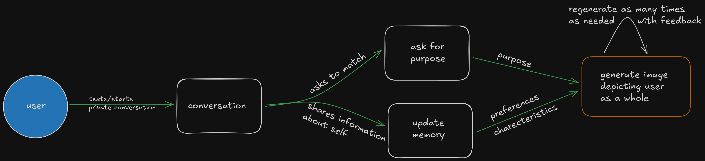
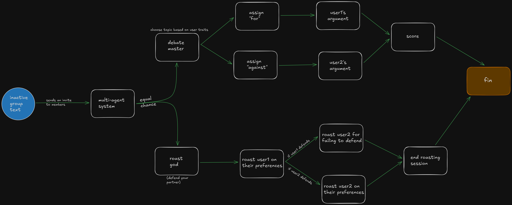

# The EQ Layer

### _Where Artificial Intelligence meets Emotional Connection._

## 📖 Overview

The **EQ Layer** is a sophisticated middleware solution designed to inject Emotional Intelligence into P2P social networking. Unlike traditional AI agents focused on productivity or task automation, this system utilizes multi-agent workflows to foster genuine human connection.

It functions as an intelligent connectivity engine, leveraging persistent memory, generative imagery, and state-managed conversational flows to transform transactional messaging into meaningful relationships.

## 🛠 Tech Stack

- **Orchestration:** Apache Kafka
- **Caching & State:** Redis (Server-side)
- **Agent Logic:** Multi-Agent Graph Architecture
- **Generative AI:** LLMs for inference; Diffusion models for visual matching
- **Interface:** Headless / Messaging-App Native

---

## 🏗 System Architecture

The project is built on an event-driven architecture designed to handle high-concurrency messaging workloads without latency.

### 1. Data Flow & Scalability

The most significant engineering challenge was modeling the data flow between the application layer and the user at scale. To address this, the system decouples message processing from response generation.

- **Apache Kafka:** Acts as the central event streaming backbone. User interactions are published to Kafka topics, allowing for asynchronous processing of heavy inference tasks (trait analysis, image generation) without blocking the user interface.
- **Redis Cache:** Utilized for high-speed state management. It stores the immediate context of active conversations and the "emotional state" of the agents, ensuring real-time responsiveness during the "Roast" and "Debate" modes.

---

## 🧠 Core Features & Implementation

### 1. Memory Infrastructure

Standard AI interactions are ephemeral. The EQ Layer implements a **Memory Infrastructure Layer** that analyzes chat logs in real-time to infer user traits, interests, and communication styles.

- **Mechanism:** Inferred traits are serialized and stored, creating a dynamic "User Profile" that evolves with every interaction.
- **Utility:** These traits drive the matching algorithm and personalize the tone of future agent interactions.

### 2. Generative Visual Matching

To facilitate high-fidelity introductions, the system replaces text-based bios with AI-generated imagery.

- **Process:** The system retrieves the inferred traits of two matched users, synthesizes a prompt representing their shared grounds, and utilizes a high-end image generation model to render a unique "Introduction Card."
- **Philosophy:** "A picture speaks a thousand words"—visuals bypass social friction more effectively than text.

### 3. State-Managed Conversational Flows

To prevent connection drop-off in group chats, I engineered specific conversational frameworks using multi-agent graphs. These graphs manage the transition between conversation states (e.g., Introduction -> Conflict -> Resolution).

**Flow A: "Defend from the AI Roast God"**
_A gamified cooperative mode where users unite to defend against a witty, antagonistic AI agent._

**Flow B: "Debate Mode"**
_A structured moderation mode where the AI facilitates a topic-based discussion to deepen understanding._

---

## 🧩 Challenges: Graph Design

Designing the multi-agent graphs was the most complex logical hurdle. Unlike linear chatbots, these agents required a non-deterministic state machine to handle the chaos of human group conversation.

- **Solution:** Implemented a directed graph where nodes represent conversation states (e.g., _WaitingForRebuttal_, _EvaluatingHumor_) and edges represent user triggers. Redis locks were used to maintain state consistency across distributed instances.

## 🔮 Future Roadmap

- Developing cooperative puzzle-solving modes based on shared user interests.
- Refactoring the Redis state management to support $N > 2$ users in real-time flows.
- Implementing guardrails for the agent graph to handle off-topic interruptions more gracefully.
